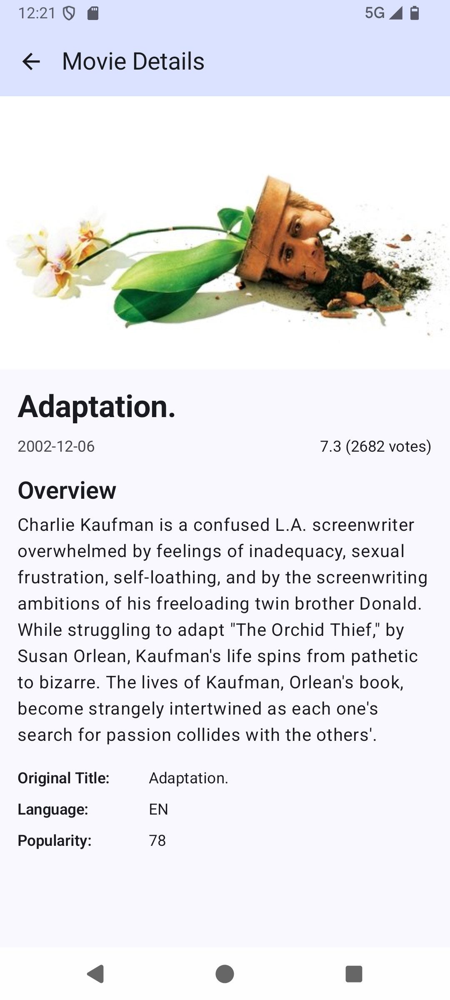
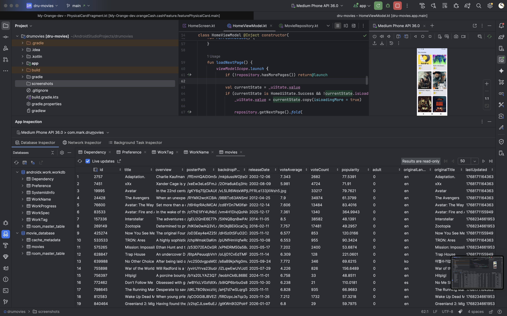

# Dru Movies

Get All popular movies clean architecture project utilizing compose and latest libraries for best maintainbilty and scalipilty


## Architecture and libraries

- **MVVM** (Model-View-ViewModel)
- **Hilt** for Dependency Injection
- **Room** for local database
- **Retrofit** for API calls
- **Coroutines** for async operations
- **Jetpack Compose** for UI
- **Navigation Component**
- **WorkManager** for background movies fetching


## Functionality

- **Data Fetching** from TMDb API 
- **Offline First** intelligent Data Caching
- **Prioritizing Cached Data** use offline data in the room data base first then update it
- **Background Data Refresh** a seperate work manager to fetch movies every 4 hours 
- **Coroutines** for async operations
- **Pagination** Endless Scrolling with page tracking 


## Project Structure
```
app/
├── data/
│   ├── local/ (Room entities, DAOs, Database)
│   ├── remote/ (API, DTOs)
│   ├── repository/
│   └── mapper/
│   └── workers/
├── domain/
│   ├── model/
│   └── repository/
├── presentation/
│   ├── home/
│   ├── details/
│   └── navigation/
├── di/ (Hilt modules)
└── workers/ (WorkManager)
```
## Screenshots

<div style="display: flex; gap: 10px;">
  
  
  
</div>
